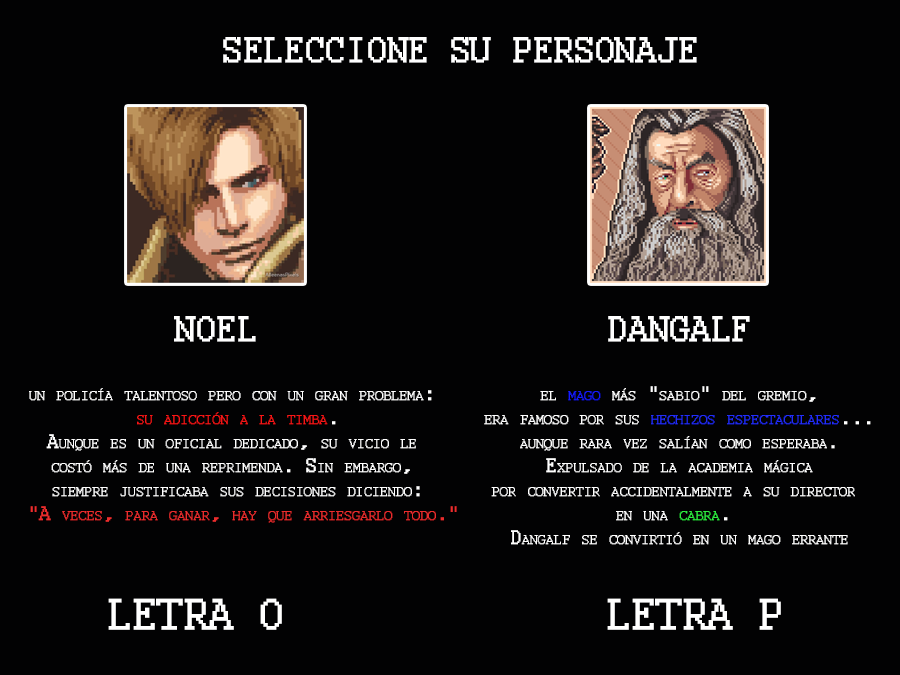
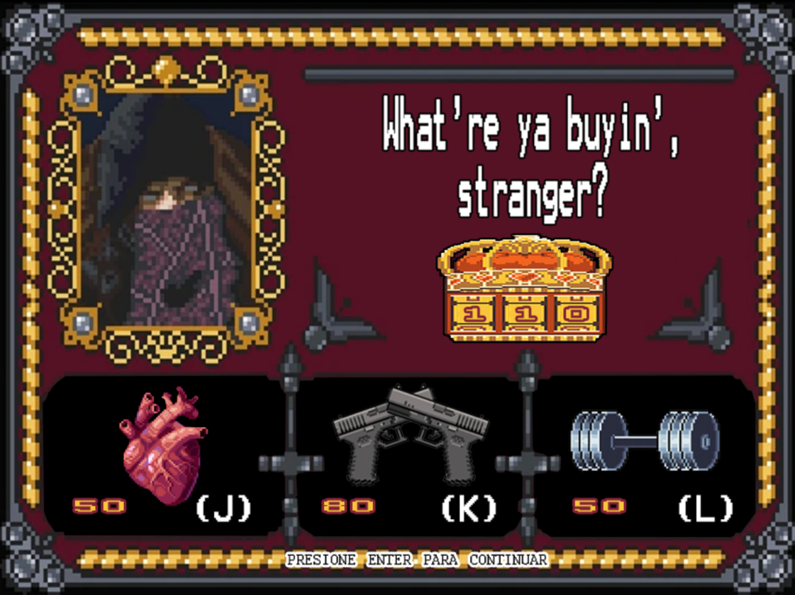

 
  

<!-- ## Capturas -->
<h1 align="center"> Sobre el juego </h1> 

<h2 align="justify"> 
  En Desvariados, el jugador podrá elegir entre controlar a Noel o Dangalf para derrotar zombies en 4 (o más :eyes:)
  niveles progresivamente más duraderos. Ambos manejan un rango de armas distintas, además de habilidades especiales, las 
  cuales pueden activar luego de asesinar a 6 zombies. 
</h2>

 
  

<h2 align="justify"> 
  A través del juego, al finalizar cada nivel, el jugador tendrá la oportunidad de mejorar su arma, su energía y sus puntos
  de vida en la tienda para facilitar sus encuentros con varios enemigos. Para lo cual, necesitará del oro que fue consiguiendo
  durante su matanza.
</h2>

 
  

<h2 align="justify"> 
  Durante los niveles, el jugador tendrá que preocuparse por no quedarse sin balas o energía de movimiento cerca de alguno de 
  los 3 tipos distintos de zombies que puede encontrarse.
</h2>

## Otros

- Curso/Facultad
- Versión de wollok
- Una vez terminado, no tenemos problemas en que el repositorio sea público / queremos manternerlo privado

  -----

<h1 align="center"> Equipo de desarrollo </h1>

<h2 align="center">
  Acuña, Alan  
   
  Bogarín, Leandro  
   
  Fuentes, Joaquín  
   
  Mártire, Santiago  
   
</h2>

