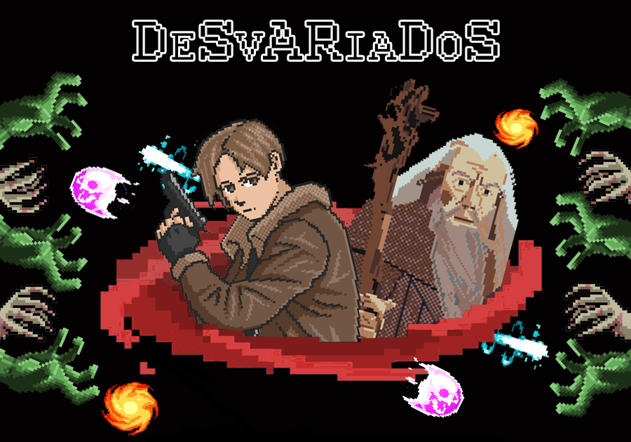

-----

## Equipo de desarrollo

 
- Acuña, Alan
- Bogarín, Leandro
- Fuentes, Joaquín
- Mártire, Santiago

## Capturas

(agregar)

## Reglas de Juego / Instrucciones

(Escribirlas)

## Otros

- Curso/Facultad
- Versión de wollok
- Una vez terminado, no tenemos problemas en que el repositorio sea público / queremos manternerlo privado
